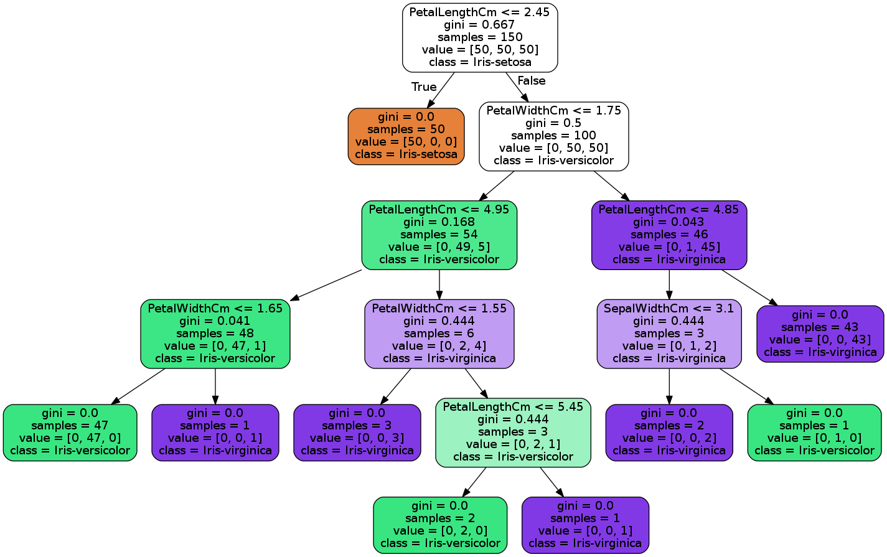

# Supervised Learning

Pada supervised learning kita melatih sekumpulan data yang memiliki label. Label adalah pengenal dari sebuah data.

Misal buah A memiliki atribut atau fitur berwarna hijau, bentuknya bulat, dan ukurannya sebesar bola sepak. Buah B atributnya berwarna kuning, bentuknya agak memanjang, dan besarnya segenggaman tangan. Buah yang memiliki atribut seperti yang disebutkan pada buah A dikenali sebagai semangka, sedangkan buah dengan atribut seperti disebutkan pada buah B dikenal sebagai pisang. Maka label dari buah A adalah semangka dan label buah B adalah pisang. 

Sekumpulan data yang memiliki label biasanya digunakan untuk membuat model klasifikasi. Pada kasus di atas, Anda dapat menggunakan machine learning untuk membuat model klasifikasi buah. Model machine learning Anda akan mempelajari pola berdasarkan atribut dari data buah yang Anda miliki. 

Model juga belajar bahwa buah dengan atribut tertentu memiliki label tertentu, label A, misalnya. Dari pengalaman belajar tersebut, model machine learning Anda dapat digunakan untuk memprediksi data baru, dan menentukan apakah data baru ini termasuk buah dengan label A atau label B. 

Algoritma supervised learning yang juga populer adalah regresi. 

Berikut adalah contoh permasalahan yang bisa diselesaikan dengan regresi. Anda memiliki data tentang penjualan properti di Kota Jakarta. Lantas Anda diminta untuk memprediksi harga properti di daerah Jakarta Selatan. Beberapa fitur penting yang berpengaruh terhadap harga properti biasanya adalah, lokasi, luas tanah, luas rumah, dan jumlah kamar. Dari data yang Anda miliki, model machine learning belajar bahwa properti dengan fitur-fitur berkelas, tentu akan memiliki harga tinggi, dan sebaliknya. Output dari model ini adalah sebuah fungsi yang dapat digunakan untuk memprediksi harga properti seperti yang diminta.

Pada masalah regresi kita memprediksi hasil dalam keluaran yang kontinyu berupa fungsi. Jika terdapat kontinuitas dalam keluaran model ML, maka dapat dipastikan itu adalah permasalahan regresi. Misalnya saat kita memprediksi harga rumah, model kita memprediksi harganya Rp. 499.999.000 atau Rp. 500.100.000, padahal harga seharusnya adalah Rp. 500.000.000. Perbedaan ini tak jadi masalah sebab hasil prediksi dalam regresi linear akan berada dalam range bilangan numerik tertentu yang mendekati nilai seharusnya. Inilah yang dimaksud dengan regresi memberikan keluaran yang kontinyu. 

Sedangkan pada masalah klasifikasi, kita memprediksi hasil dalam keluaran diskrit. Misal, apakah email ini dapat diklasifikasikan sebagai spam atau bukan spam? Jelas bahwa tidak ada kontinuitas antara email spam dan bukan spam. Email spam tidak sama dengan bukan spam, serta tidak ada kategori antara email spam dan bukan spam.

Berikut adalah beberapa algoritma supervised learning:

* Linear Regression
* Logistic Regression
* Classification
* Decision Trees
* Support Vector Machines
* Neural Networks.

[Cake Analogy](https://syncedreview.com/2019/02/22/yann-lecun-cake-analogy-2-0/)

## Classification

### Binary Classification

Klasifikasi yang menghasilkan dua kategori disebut klasifikasi biner, sedangkan klasifikasi yang menghasilkan 3 kategori atau lebih disebut multiclass classification atau klasifikasi banyak kelas.

Bayangkan sebuah pertanyaan yang jawabannya adalah iya atau tidak, atau pertanyaan yang membuat Anda memilih antara satu pilihan atau pilihan yang lain. Klasifikasi biner bertujuan untuk membedakan dua kelas yang berbeda. Contohnya, klasifikasi buah semangka atau apel, klasifikasi laki-laki atau perempuan, klasifikasi email spam, dan lain-lain. Pada kasus klasifikasi email sebagai spam atau bukan, pertanyaan yang diajukan adalah: “Apakah email ini adalah spam?”

### Multiclass Classification

Untuk lebih mudah dalam memahami klasifikasi banyak kelas, kita akan menggunakan contoh dataset Iris. Dataset iris merupakan salah satu dataset populer untuk belajar bagaimana ML dipakai dalam klasifikasi. Dataset ini berisi 150 sampel dari 3 spesies bunga iris. 

Pada dataset Iris terdapat 4 kolom atribut yaitu panjang sepal, lebar sepal, panjang petal, dan lebar petal. Untuk label terdapat 3 kelas yaitu Setosa, Versicolor dan Virginica. Kelas adalah kategori atau jenis yang terdapat pada dataset. Dalam hal ini pada dataset terdapat 3 kelas yaitu Setosa, Versicolor, dan Virginica.

Sebuah model classification bertujuan untuk menentukan kelas berdasarkan atribut tertentu. Pada kasus klasifikasi Iris sebuah model bertugas untuk memprediksi spesies sebuah bunga iris berdasarkan atributnya yaitu panjang sepal, lebar sepal, panjang petal, dan lebar petalnya.

Contohnya panjang petal dari Iris Setosa lebih pendek dari spesies versicolor dan virginica. Jika panjang petal pendek maka kemungkinan spesies Iris tersebut adalah Setosa.

### Decision Tree

Decision tree atau pohon keputusan adalah salah satu algoritma supervised learning yang dapat dipakai untuk masalah klasifikasi dan regresi. Decision tree merupakan algoritma yang powerful alias mampu dipakai dalam masalah yang kompleks. Decision tree juga merupakan komponen pembangun utama algoritma Random Forest, yang merupakan salah satu algoritma paling powerful saat ini.

Decision tree memprediksi sebuah kelas (klasifikasi) atau nilai (regresi) berdasarkan aturan-aturan yang dibentuk setelah mempelajari data.

Misalnya kita memiliki data seperti di bawah. Data berisi informasi mengenai kondisi cuaca pada hari tertentu dan apakah cocok untuk bermain golf di kondisi cuaca tersebut.

| Outlook | Temperature | Humidity | Windy | Play Golf | 
|---------|-------------|----------|-------|-----------|
| Rainy | Hot | High | False | No | 
| Rainy | Hot | High | True | No | 
| Overcast | Hot | High | False | Yes | 
| Sunny | Mild | High | False | Yes | 
| Sunny | Cold | Normal | False | Yes | 
| Sunny | Cold | Normal | True | No | 
| Overcast | Cold | Normal | True | Yes | 
| Rainy | Mild | High | False | No | 
| Rainy | Cold | Normal | False | Yes | 
| Rainy | Mild | Normal | False | Yes |

Sebuah pohon keputusan dapat dibuat dari data sebelumnya. Perhatikan contoh pohon keputusan di bawah. Pohon ini menggunakan hanya 2 atribut yaitu kondisi langit dan kecepatan angin untuk menentukan bermain golf atau tidak.

[Konversi dot file ke dalam file png untuk melihat visualisasi decision tree](https://onlineconvertfree.com/converter/images/)

[Latihan SKLearn Decision Tree](https://jp-tok.dataplatform.cloud.ibm.com/analytics/notebooks/v2/f249deb9-6028-4c9f-9524-77439ee599c0?projectid=f052c4d4-84ba-485b-8bd0-827f0b83f55f&context=cpdaas)

[Decision Tree](https://towardsdatascience.com/decision-trees-in-machine-learning-641b9c4e8052)

[Find all files in a directory with extension](https://stackoverflow.com/questions/3964681/find-all-files-in-a-directory-with-extension-txt-in-python)